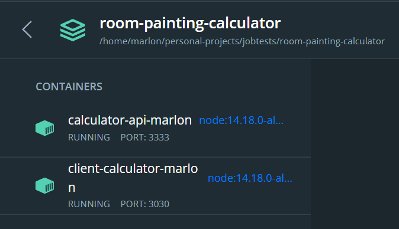
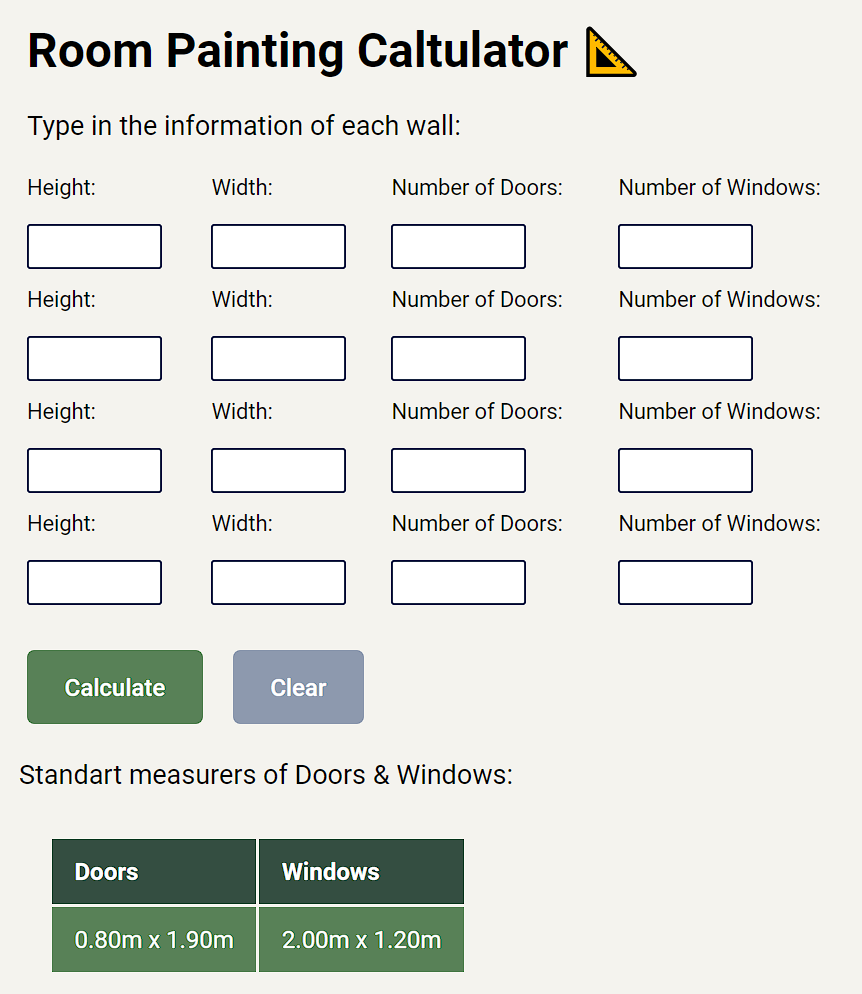
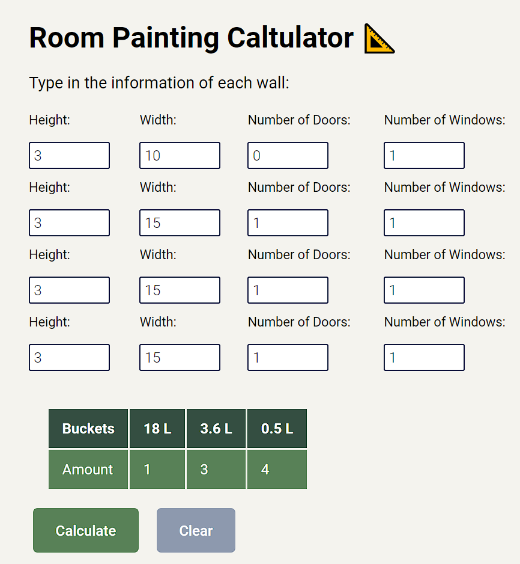

# Room Painting Calculator 🌈

## Aplicação Web desenvolvida utilizando as tecnologias TypeScript, ReactJS, Vite, NodeJS, Express, Axios  🛠

[](https://www.typescriptlang.org/) [](https://nodejs.org/en/) [](https://pt-br.reactjs.org/docs/getting-started.html) [](https://vitejs.dev/guide/)

Esta calculadora irá te auxiliar na hora de calcular a quantidade de litros de tinta baseada nas medidas em m² de um quarto e na quantidade de portas e janelas, ao final lhe retornará uma sugestão com os tamanhos de baldes de tintas e suas respectivas quantidades.

O projeto foi desenvolvido utilizando a arquitetura ou `design pattern` padrão `DDD`, aplicando os conceitos de `CleanArchture`, `CleanCode` e `SOLID`.

#### Requerimentos ✅

| Requerimento  | Uso |
| ------------- | -------------- |
| Node 14.8.x     | Realização do deploy local |
| npm .14.x     | Realização do deploy local |
| Docker 3.x    | Containerização e execução da aplicação |

#### Requisitos do desafio ✅

| Status | Requisitos |
| ------------- | -------------- |
| ✅     | Nenhuma parede pode ter menos de 1 metro quadrado nem mais de 50 metros quadrados, mas podem possuir alturas e larguras diferentes. |
| ✅    | O total de área das portas e janelas deve ser no máximo 50% da área de parede. |
| ✅    | A altura de paredes com porta deve ser, no mínimo, 30 centímetros maior que a altura da porta. |
| ✅ | Cada janela possui as medidas: 2,00 x 1,20 mtos. |
| ✅ | Cada porta possui as medidas: 0,80 x 1,90. |
| ✅ | Cada litro de tinta é capaz de pintar 5 metros quadrados. |
| ✅ | Não considerar teto nem piso. |
| ✅ | As variações de tamanho das latas de tinta são:  [0,5 L / 2,5L / 3,6L / 18L ] |

#### OBS: Há um arquivo .env.example com os dados acima, basta preencher com os seus dados a executar a aplicação.

## Containerização da aplicação utilizando o Docker 🐳
[](https://docs.docker.com/)

#### 🔴 OBS: Recomendo fortemente utilizar o Docker para executar a aplicação por questões de performance

Após clonar o repositório, acesse a pasta via terminal e execute o seguinte comando:

```bash
yarn deploy:docker
```
ou
```bash
npm run deploy:docker
```
> Este comando no instala as dependências, cria uma build nova da aplicação, em seguida exclui o container do Docker caso exista e depois recria um container com a aplicação executando o Node.js de do container com a distribuição Alpine do linux.


> Após a execução o container hubspot-integration-marlon será criado no seu Docker

### Verificando se a aplicação está executando corretamente 🐳

Agora abra a sua aplicação do `Docker` e clique no container `room-painting-calculator`, e deverá ver os seguintes logs:



#### URL da Aplicação executando em ambiente local
```bash
http://localhost:3030/
```
#### Se a aplicação for deployada será possível visualizá-lá

#### Após preencher os dados corretamente e submetêlos
