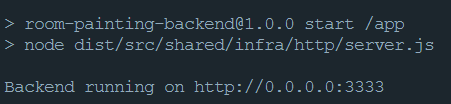

# API da Calculadora para Pintura de Quarto 🚀

## Desenvolvida utilizando as tecnologias TypeScript, Node.js, Express, Axios 🛠

[](https://www.typescriptlang.org/) [](https://nodejs.org/en/) 

Uma API RESTful que tem a função de calcular a quantidade de litros de tinta baseada nas medidas em m² de um quarto.

O projeto foi desenvolvido utilizando a arquitetura ou `design pattern` padrão `DDD`, aplicando os conceitos de `CleanArchture`, `CleanCode` e `SOLID`.

#### Requerimentos ✅

| Requerimento  | Uso |
| ------------- | -------------- |
| Yarn 1.1x     | Execução da aplicação e realização do deploy local |
| Docker 3.x    | Containerização e execução da aplicação |


### Verificando se a aplicação está executando corretamente 🐳

Agora abra a sua aplicação do `Docker` e clique no container `room-painting-calculator` ➡ `calculator-api-marlon`, e deverá ver os seguintes logs:



> Se tudo estiver executando perfeitamente os logs da imagem acima deverão ser exibidos.

### Para obter a documentação do Endpoint da Api  basta clicar no botão abaixo:

[](./ENDPOINT.md)


### Pasta raiz do projeto 📁
```
    ├── .github        # Arquivos utilizados pelo GitHub
    ├── src            # Arquivos de Recursos da aplicação
    │   ├── modules    # Módulos da aplicação onde se encontrão os domínios
    │   └── shared     # Pasta com os recursos compartilhados entre os domínios
    └── ...
```

### Pasta de Modules 📁

```
├── modules                   # Módulos da aplicação
│   └── bucketsCalculator     # Módulo da calculadora de baldes de tinta
└── ...
```

### Dentro de um módulo 📁

```
    ├── ...
    ├── contacts       # Módulo da calculadora de baldes
    │   ├── infra         # Infra específico do módulo
    │   └── services      # Services com as regras de negócio do domínio
    └── ...
```

### Dentro da pasta infra de um módulo 📁

```
        ├── ...
        ├── infra                 # Infra específico do módulo
        │   └── http              # Recursos HTTP do domínio
        │       ├── controllers   # Controllers das requisições das rotas
        │       └── routes        # Configuração da rota da calculadora de baldes tinta
        └── ...
```

### Dentro da pasta shared 📁

```
  ├── ...
  ├── shared                  # Shared recursos compartilhados entre os domínios
  │   ├── containers          # Container com as injeções de dependências dos repositórios
  │   │   └── providers       # Providers compartilhados entre os módulos
  │   ├── errors              # Configuração de mensagens de erros retornadas
  │   └── infra               # Infra da aplicação como um todo
  │       ├── http            # Configurações HTTP da aplicação routes/server
  │          ├── app          # Instância da aplicação
  │          ├── middlewares  # Middlewares para validação de requisições
  │          └── routes       # Instância de rotas de cada módulo da aplicação
  └── ...
```